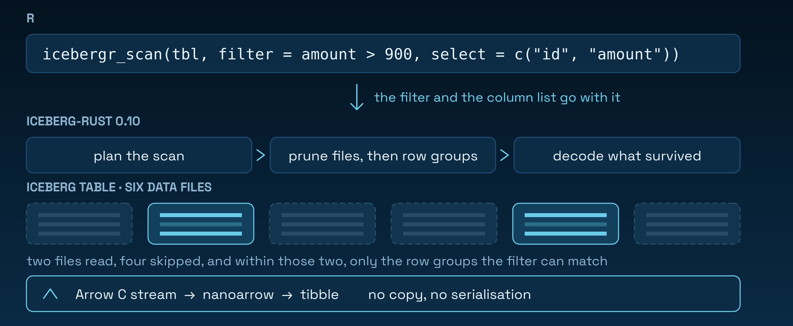

<!-- README.md is generated from README.Rmd. Please edit that file -->

# icebergr 

<!-- badges: start -->
[](https://CRAN.R-project.org/package=icebergr)
[](https://github.com/PursuitOfDataScience/icebergr/actions/workflows/R-CMD-check.yaml)
<!-- badges: end -->

Apache Iceberg tables, read and written from R. No DuckDB in the middle, no CSV
export — R was the last major data language without an Iceberg client.

```r
install.packages("icebergr")
pak::pak("PursuitOfDataScience/icebergr") # development version
```

## Read

```r
library(icebergr)
tbl <- icebergr_example_table()

icebergr_collect(
  icebergr_scan(tbl, filter = amount > 900, select = c("id", "amount"))
)
```



Worth checking rather than assuming: `icebergr_scan_plan()` lists the surviving
files before a byte is read.

```r
nrow(icebergr_scan_plan(icebergr_scan(tbl))) #> 2
nrow(icebergr_scan_plan(icebergr_scan(tbl, filter = id > 1000))) #> 1
```

## Time travel

```r
h <- icebergr_snapshots(tbl) # snapshot_id, operation, ...

icebergr_collect(icebergr_scan(tbl, snapshot_id = h$snapshot_id[[1]]))
icebergr_collect(icebergr_scan(tbl, as_of = h$timestamp[[1]]))
```

`as_of` resolves against Iceberg's snapshot *log*, so a snapshot a rollback
abandoned is not selected.

## Write

```r
icebergr_append(tbl, data.frame(id = 9001L, event = "purchase", amount = 42.5))
```

## Catalogs

Credentials come from the environment, never from arguments.

```r
Sys.setenv(ICEBERGR_REST_TOKEN = "...")
catalog <- icebergr_catalog("rest", uri = "https://catalog.example.com")
tbl <- icebergr_table(catalog, "analytics.events")
```

`vignette("catalog-configuration")` covers REST, Glue and S3.

## What works

Table spec **v1 and v2**, on `iceberg-rust` 0.10.0. `icebergr_spec_support()`
reports the matrix below for your own build.

| | ✅ works | not available |
| --- | --- | --- |
| **Read** | predicate, projection and row-group pushdown · merge-on-read positional *and* equality deletes · nested `struct` / `list` / `map` · `icebergr_scan_plan()` | 🦀 `limit` pushdown · 🦀 pushdown *onto* a nested field |
| **Time travel** | snapshot history · read by snapshot id or timestamp · read the schema, filter and select as of a snapshot | |
| **Write** | append to an unpartitioned table · create a table or namespace · register an existing table · v1 tables stay v1 | 🚧 append to a *partitioned* table · 🦀 row-level deletes, `MERGE`, overwrite |
| **Catalogs** | REST · in-process `memory` · ⚙️ AWS Glue · ⚙️ S3 | 🦀 Hadoop / filesystem — use `memory` |
| **Metadata** | schema · partition spec · properties · `icebergr_reload()` for another session's commits | 🚧 setting properties |

⚙️ needs a Cargo feature at build time &nbsp;·&nbsp; 🦀 missing upstream in
`iceberg-rust` &nbsp;·&nbsp; 🚧 out of scope for 0.1.0, along with schema and
partition evolution, snapshot expiry, `dbplyr` verbs and encryption

A correct narrow surface beats a broad buggy one: everything above raises an
informative error rather than failing obscurely.

## Types

`integer`, `double`, `character`, `logical`, `Date`, `POSIXct`, `struct` (a data
frame column) and `list` (a `vctrs::list_of`) all round-trip unchanged. The
exceptions:

| | |
| --- | --- |
| `NaN` | comes back `NA`. R's `is.na(NaN)` is `TRUE`, so it is written as a null |
| `factor` | comes back `character`. Iceberg has no dictionary type |
| `long` | needs `bit64` installed, or Arrow's `int64` narrows to a `double` |
| `timestamp_ns` | a `POSIXct` is a double of *seconds*, so sub-microsecond precision is lost |
| snapshot ids | **`character`**, not numeric — they are random 64-bit integers and a double holds 53 bits |

## Building from source

A CRAN binary needs no Rust toolchain. Compiling from source does: `rustc` >=
1.92, and a few minutes for 264 crates. The default build is fully vendored and
never touches the network; the two optional backends fetch from crates.io.

```sh
ICEBERGR_CARGO_FEATURES=s3 R CMD INSTALL --preclean .   # or glue, which implies s3
```

[`FEASIBILITY.md`](https://github.com/PursuitOfDataScience/icebergr/blob/main/FEASIBILITY.md)
has the vendoring and MSRV analysis behind those numbers.

## Licence

GPL (>= 3). Bundled Rust crates keep their own licences, listed in `inst/NOTICE`
and `LICENSE.note`.

Apache, Apache Iceberg and Iceberg are trademarks of The Apache Software
Foundation. `icebergr` is an independent community package, not affiliated with
or endorsed by the ASF, and is not one of the official Iceberg clients. The logo
is original artwork and does not use or imitate any Apache mark.
